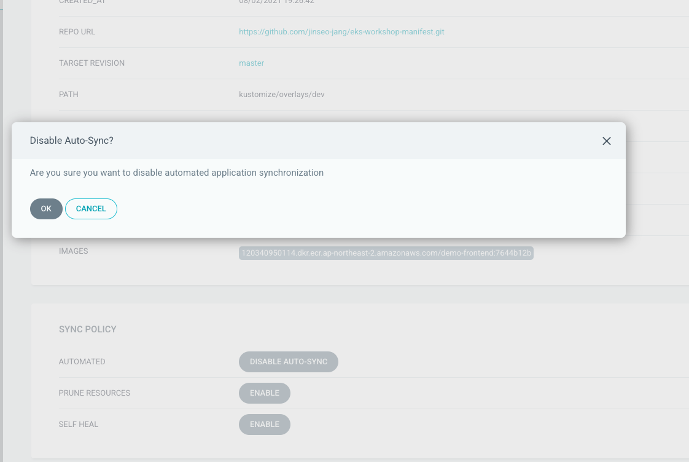
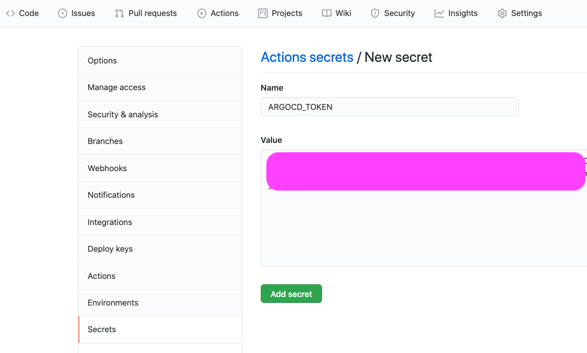
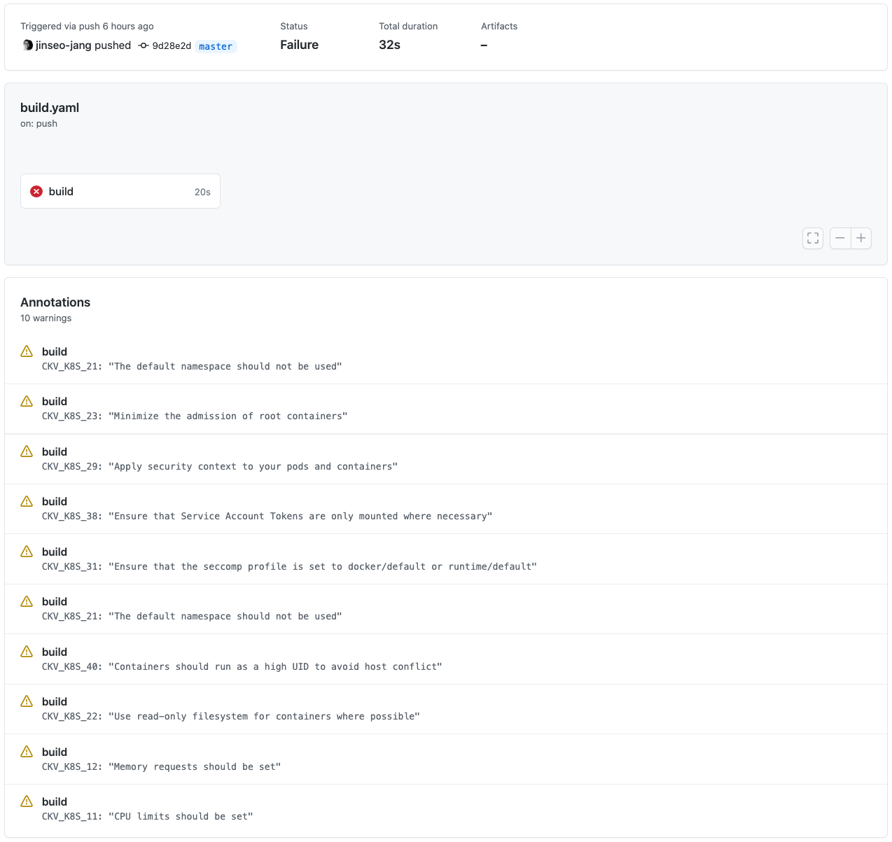

# Employ kubernetes static analysis step using Checkov

## Overview

k8s manifest 를 배포 하기 전에 [**Checkov**](https://github.com/bridgecrewio/checkov)를 이용하여 k8s manifest 가 security, misconfiguration 관점에서 문제가 없는지 검사하는 단계를 ci/cd 파이프라인에 추가 합니다.

이를 위해 ArgoCD가 k8s manifest repo를 watch 하고 있다가 변경 사항이 발생하면 CD 작업이 시작 되던 기존 방식을 다음과 같이 변경 합니다.

    (1). application repo 변경 작업이 발생 되고 새로운 docker image 가 생성 되며 이어 새로운 image tag 값이 k8s manifest repo에 commit 된다.
    (2). k8s manifest repo에 새로운 image tag 값이 commit 되면 kustomize 를 이용해 최종 k8s manifest를 생성 한다(kustomize build)
    (3). 생성된 최종 k8s manifests에 대해 Checkov 를 통해 정적 코드 분석 작업을 수행 한다.
    (4). 분석 작업 결과에 문제가 없으면 ArgoCD application 의 Sync 작업을 시작 한다.

위 네 단계는 다음의 repository 에서 수행 됩니다.

- (1) : **Application repository** 의 **github Action**
- (2)~(4) : **k8s manifest repository** 의 **github Action**

### Lab1 주요 작업 내용

- **k8s manifest repository** github action **build script** 생성
- **ArgoCD** **_AUTO_SYNC_** 비활성화 (**_Manual_**)
- **ArgoCD** 신규 **account** 생성
- **ArgoCD** 신규 **account** 에 대한 **_auth-token_** 생성
- **Argocd** 신규 **account** 애 대한 **Argo RBAC** 설정

# 1. **k8s manifest repository** github action **build script** 생성

```bash
cd ~/environment/ks8-manifest-repo
mkdir -p ./.github/workflows
cat <<EOF> build.yaml
name: "ArgoCD sync"
on: "push"

jobs:
  build:
    runs-on: ubuntu-latest
    steps:

      - name: Checkout source code
        uses: actions/checkout@v2

      - name: Setup Kustomize
        uses: imranismail/setup-kustomize@v1

      - name: Build Kustomize
        run: |
          pwd
          mkdir kustomize-build
          kustomize build ./overlays/dev > ./kustomize-build/kustomize-build-output.yaml
          ls -rlt
          cd kustomize-build
          cat kustomize-build-output.yaml

      - name: Run Checkov action
        id: checkov
        uses: bridgecrewio/checkov-action@master
        with:
          directory: kustomize-build/
          framework: kubernetes

      - name: Install ArgoCD and execute Sync in ArgoCD
        run: |
          curl -sSL -o /usr/local/bin/argocd https://github.com/argoproj/argo-cd/releases/latest/download/argocd-linux-amd64
          chmod +x /usr/local/bin/argocd
          ARGO_SERVER=ab8aee80cfa7145e5a03ff7ea4cf6a72-239770354.ap-northeast-2.elb.amazonaws.com
          argocd app sync eksworkshop-cd-pipeline --auth-token ${{ secrets.ARGOCD_TOKEN }} --server $ARGO_SERVER --insecure

EOF
```

## 2. ArgoCD\*\* **_AUTO_SYNC_** 비활성화 (**_Manual_**)

Applicaiton > eksworkshop-cd-pipeline 으로 이동 하여 APP DETAILS 클릭 합니다. 이어 SYNC_POLICY 의 AUTOMATED 값을 DISABLE AUTO-SYNC 로 변경 합니다.



## 3. **ArgoCD** 신규 **account** 생성

k8s manifest repo 의 github action가 ArgoCD Sync 를 호출 하기 위해 사용할 새로운 ArgoCD account 를 생성 합니다. 기존 admin 과 별도로 생성 하여 별도의 role을 부여해 보안을 향상 합니다.

새로운 account 는 **`devops`** 입니다.

ArgoCD 의 account 추가는 ArgoCD의 Configmap을 통해서 가능합니다.

아래 명령을 실행 합니다.

```bash
kubectl -n argocd edit configmap argocd-cm -o yaml
```

그리고 다음을 추가 합니다.

```yaml
data:
  accounts.devops: apiKey,login
```

최종 모습은 다음과 같아야 합니다. (\* `createTimestamp`, `resourceVersion` 등의 값은 환경 마다 상이 합니다.)

```yaml
apiVersion: v1
data:
  accounts.devops: apiKey,login
kind: ConfigMap
metadata:
  annotations:
    kubectl.kubernetes.io/last-applied-configuration: |
      {"apiVersion":"v1","kind":"ConfigMap","metadata":{"annotations":{},"labels":{"app.kubernetes.io/name":"argocd-cm","app.kubernetes.io/part-of":"argocd"},"name":"argocd-cm","namespace":"argocd"}}
  creationTimestamp: "2021-07-28T07:45:53Z"
  labels:
    app.kubernetes.io/name: argocd-cm
    app.kubernetes.io/part-of: argocd
  name: argocd-cm
  namespace: argocd
  resourceVersion: "153620981"
  selfLink: /api/v1/namespaces/argocd/configmaps/argocd-cm
  uid: a8bb80e7-577c-4f10-b3de-359e83ccee20
```

추가가 완료 되면 **`:wq!`** 을 입력하여 저장 하고 종료 합니다.

# 4. **ArgoCD** 신규 **account** 에 대한 **_auth-token_** 생성

새로운 ArgoCD account 인 **`devops`** 가 사용할 _auth-token_ 을 생성 합니다. 이는 argocd api를 이용해 작업을 호출할 때 사용하는 인증 토큰 입니다. 즉 login password 와 별개의 값이 입니다.

아래 명령을 실행 하고 출력 되는 토큰 값을 **따로 저장 해둡니다. 뒤이은 작업에서 사용합니다**

```bash
argocd account generate-token --account devops
```

저장 한 토큰 값을 k8s manifest repository에서 사용할 **Secrets** 으로 저장 합니다. repository 로 이동 한 다음 Settings > Secrets 순서로 이동 합니다. 그리고 우측 상단의 **New repository secret**을 클릭 합니다. **Secrets** 의 **Name** 은 **_ARGOCD_TOKEN_** 으로 입력 하고 **Value**는 **저장한 토큰** 값을 복사 하여 붙여 넣습니다. 그리고 **Add Secret** 을 클릭 합니다.



# 5. **Argocd** 신규 **account** 애 대한 **Argo RBAC** 설정

새로 생성한 ArgoCD account 는 Sync를 호출할 수 있는 permission 이 없습니다. 따라서 ArgoCD가 사용하는 RBAC 규칙에 맞게 새롭게 permission 을 할당해주어야 합니다.

ArgoCD RBAC 을 추가하려면 ArgoCD Confimap 인 `argocd-rbac-cm` 을 수정해야 합니다. 다음 명령을 실행 하여 수정을 시작 합니다.

```bash
kubectl -n argocd edit configmap argocd-rbac-cm -o yaml
```

아래 값을 추가 합니다. 실습을 위해 많은 권한을 부여 했습니다. 실제 운영 현장에서는 필요한 권한만을 추가 합니다.

```yaml
data:
  policy.csv: |
    p, role:devops, applications, *, */*, allow
    p, role:devops, clusters, get, *, allow
    p, role:devops, repositories, get, *, allow
    p, role:devops, repositories, create, *, allow
    p, role:devops, repositories, update, *, allow
    p, role:devops, repositories, delete, *, allow
```

최종 모습은 다음과 같아야 합니다. (\* `createTimestamp`, `resourceVersion` 등의 값은 환경 마다 상이 합니다.)

```yaml
apiVersion: v1
data:
  policy.csv: |
    p, role:devops, applications, *, */*, allow
    p, role:devops, clusters, get, *, allow
    p, role:devops, repositories, get, *, allow
    p, role:devops, repositories, create, *, allow
    p, role:devops, repositories, update, *, allow
    p, role:devops, repositories, delete, *, allow

    g, devops, role:devops
  policy.default: role:readonly
kind: ConfigMap
metadata:
  annotations:
    kubectl.kubernetes.io/last-applied-configuration: |
      {"apiVersion":"v1","kind":"ConfigMap","metadata":{"annotations":{},"labels":{"app.kubernetes.io/name":"argocd-rbac-cm","app.kubernetes.io/part-of":"argocd"},"name":"argocd-rbac-cm","namespace":"argocd"}}
  creationTimestamp: "2021-07-28T07:45:53Z"
  labels:
    app.kubernetes.io/name: argocd-rbac-cm
    app.kubernetes.io/part-of: argocd
  name: argocd-rbac-cm
  namespace: argocd
  resourceVersion: "153629591"
  selfLink: /api/v1/namespaces/argocd/configmaps/argocd-rbac-cm
  uid: 1fe0d735-f3a0-4867-9357-7a9e766fef22
```

# 6. Commit & Push k8s manifest code

변경된 코드를 commit/push 합니다.

```bash
cd ~/environment/k8s-manifest-repo
git add .
git commit -m "Add github action with ArgoCD"
git push -u origin main
```

소스 commit/push 이후 **k8s manifest repo github action(build) > ArgoCD(deploy)** 작업이 순서대로 동작 하는지 살펴 봅니다.

k8s manifest repository의 github Actions 빌드 과정에서 다음과 같이 에러가 발생 합니다. 이는 새롭게 추가된 **Checkov** 의 k8s manifest 정적 코드 분석 결과 입니다. 모범 사례 기반 현재 누락된 설정을 경고와 함께 표시 해줍니다.



**Checkov** 동작을 확인했으므로 실습을 위해 분석 대상을 줄여서 다시 수행 하겠습니다.

다음 명령을 실행하여 **Checkov** 분석 대상을 한 가지 만(`CKV_K8S_17`)으로 줄입니다.

```bash
cd ~/environment/ks8-manifest-repo
mkdir -p ./.github/workflows
cat <<EOF> build.yaml
name: "ArgoCD sync"
on: "push"

jobs:
  build:
    runs-on: ubuntu-latest
    steps:

      - name: Checkout source code
        uses: actions/checkout@v2

      - name: Setup Kustomize
        uses: imranismail/setup-kustomize@v1

      - name: Build Kustomize
        run: |
          pwd
          mkdir kustomize-build
          kustomize build ./overlays/dev > ./kustomize-build/kustomize-build-output.yaml
          ls -rlt
          cd kustomize-build
          cat kustomize-build-output.yaml

      - name: Run Checkov action
        id: checkov
        uses: bridgecrewio/checkov-action@master
        with:
          directory: kustomize-build/
          framework: kubernetes
          check: CKV_K8S_17

      - name: Install ArgoCD and execute Sync in ArgoCD
        run: |
          curl -sSL -o /usr/local/bin/argocd https://github.com/argoproj/argo-cd/releases/latest/download/argocd-linux-amd64
          chmod +x /usr/local/bin/argocd
          ARGO_SERVER=ab8aee80cfa7145e5a03ff7ea4cf6a72-239770354.ap-northeast-2.elb.amazonaws.com
          argocd app sync eksworkshop-cd-pipeline --auth-token ${{ secrets.ARGOCD_TOKEN }} --server $ARGO_SERVER --insecure

EOF
```

변경된 코드를 commit/push 합니다.

```bash
cd ~/environment/k8s-manifest-repo
git add .
git commit -m "Chage Checkov check scope"
git push -u origin main
```

소스 commit/push 이후 **k8s manifest repo github action(build) > ArgoCD(deploy)** 작업이 순서대로 동작 하는지 살펴 봅니다. 정상적으로 ArgoCD 작업 까지 완료 됩니다.

# 7. Change frontend application

실제로 frontend application 코드를 변경하여 앞서 만든 pipeline 전체 과정이 정상적으로 구동되는지 확인 합니다.

## **(1)** Modify frontend application source code

**Cloud9** 으로 이동해, 좌측 폴더 구조에서 **amazon-eks-frontend/src/** 로 이동하여 **`App.js`** 더블 클릭하여 파일을 오픈 합니다.

**line 67**의 값을 **`EKS DEMO Blog version 1`** 으로 변경 하고 저장 합니다. 저장은 **ctrl+s** 를 누릅니다.

```javascript
  return (
    <div className={classes.root}>
      <AppBar position="static" style={{ background: '#2E3B55' }}>
        <Toolbar>
          <IconButton edge="start" className={classes.menuButton} color="inherit" aria-label="menu">
            <CloudIcon />
          </IconButton>
          <Typography
            variant="h6"
            align="center"
            className={classes.title}
          >
            EKS DEMO Blog version 2
          </Typography>
          {new Date().toLocaleTimeString()}
        </Toolbar>
      </AppBar>
      <br/>
```

## **(2)** commit&push

변경 코드를 git repository 에 commit&push 합니다.

```bash
cd ~/environment/amazon-eks-frontend
git add .
git commit -m "Add new blog version 2"
git push -u origin main
```

소스 commit/push 이후 **frontend application repo github action(build) > k8s manifest repo github action(build) > ArgoCD(deploy)** 작업이 순서대로 동작 하는지 살펴 봅니다. 정상적으로 ArgoCD 작업 까지 완료 됩니다.

모두 완료 되면 아래 명령을 통해 얻은 샘플 애플리케이션 주소를 브라우저를 통해 접속 합니다.

```bash
echo http://$(kubectl get ingress/backend-ingress -o jsonpath='{.status.loadBalancer.ingress[*].hostname}')
```

새로운 변경 사항이 반영된 블로그가 **_EKS DEMO Blog version 2_** 라는 메인 타이틀과 함께 확인 됩니다.
